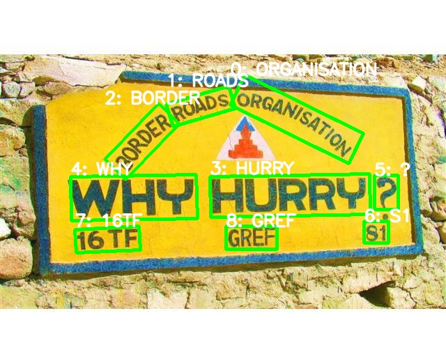
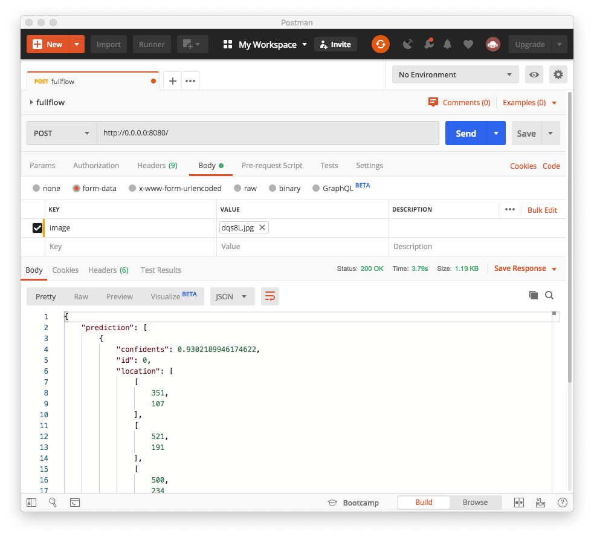

# Health Star Informatics Scence Text Extractor API
Detect and extract regions of text in real world images

Input|Output
--|--
|


## How to setup
- Install required dependencies: `pip install -r requirements.txt`
- Run the production API with `gunicorn`:
```bash
gunicorn --bind 0.0.0.0:8080 wsgi:app --timeout 100 --graceful-timeout 50 --max-requests-jitter 40 --max-requests 40 -w 2  --keep-alive 1
```

## Docker
If you prefer using a docker container. Build a docker images with this command:
```bash
docker build . -t scene_text_extractor
```
And run it with:
```bash
docker run -p 8080:8080 -it scene_text_extractor
```

## API
There will be 3 API endpoint running at `0.0.0.0:8080`
+ `\` which can handle full flow from layout analysis to deskew and OCR.
+ `\layout` for layout analysis only.
+ `\ocr` for OCR only.

You can call the API like this:


Here is the sample output from the API:
```json
{
    "prediction": [
        {
            "confidents": 0.9884889125823975,
            "id": 1,
            "location": [
                [
                    238,
                    149
                ],
                [
                    328,
                    123
                ],
                [
                    337,
                    155
                ],
                [
                    248,
                    181
                ]
            ],
            "text": "ROADS"
        },
        {
            "confidents": 0.9965834617614746,
            "id": 2,
            "location": [
                [
                    227,
                    148
                ],
                [
                    257,
                    177
                ],
                [
                    180,
                    257
                ],
                [
                    150,
                    228
                ]
            ],
            "text": "BORDER"
        },
    ],
    "run_time": "3.76",
    "success": true
}
```